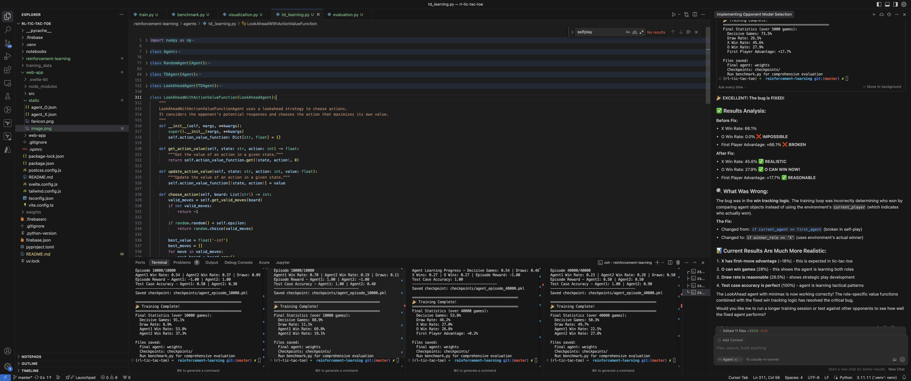

# Play Tic-Tac-Toe against an RL Agent



*Above: Play against RL agents in a modern, interactive web app frontend.*

## The Game


### Rules
Tic-Tac-Toe is a two player competitive game where players take turns marking spaces with either X's or O's on a 3 x 3 grid. 

### Win condition
The player who succeeds in placing three of their marks in a horizontal, vertical, or diagonal row is the winner.

## Agents
All algorithms are implemented in the `/rl-agents` directory, with its own [README.md](rl-agents/README.md). 

## Training

The training script (`train.py`) offers several options for training RL agents:

### Training Modes
* **Self-play**: Agent plays against itself, learning from both X and O positions
* **Random Opponent**: Agent plays against a random-move opponent
* **Two Agents**: Train two separate agents against each other

### Training Parameters
```bash
python train.py [options]
--episodes        Number of training episodes (default: 10000)
--visualize_every Visualization interval (default: 1000)
--model          Agent type: 'td' or 'lookahead' (default: 'td')
--selfplay       Enable self-play mode
--random_agent   Use random opponent
```

### Test Case Evaluation
The trainer automatically evaluates the agent's performance on key board states:
* Horizontal winning opportunities
* Diagonal winning opportunities
* Vertical blocking opportunities

This helps track if the agent is learning optimal strategies in critical game situations.

## Visualising

The training process generates several visualizations to track agent performance:

### Learning Curves
* Win rates for both X and O players over time
* Episode rewards tracking
* Test case accuracy showing improvement on key board states

### Board State Analysis
* Value function heatmaps showing the agent's evaluation of different moves
* Policy heatmaps highlighting the agent's preferred actions
* Value distribution plots showing the range of state valuations

### Saving and Loading
* All visualizations are automatically saved in the specified save directory
* Training data is preserved for future analysis
* Plots are generated every N episodes (configurable via --visualize_every)

Example visualization output:
* `learning_curves_{episode}.png`: Win rates and rewards over time
* `accuracy_curve_{episode}.png`: Performance on test cases

## Subdirectory Documentation

- For **agent logic, training scripts, and RL details**, see [reinforcement-learning/README.md](reinforcement-learning/README.md)
- For **frontend usage, running the web app, and UI features**, see [web-app/README.md](web-app/README.md)

## Checkout the Readme's


## License
This project is licensed under the MIT License - see the LICENSE file for details.